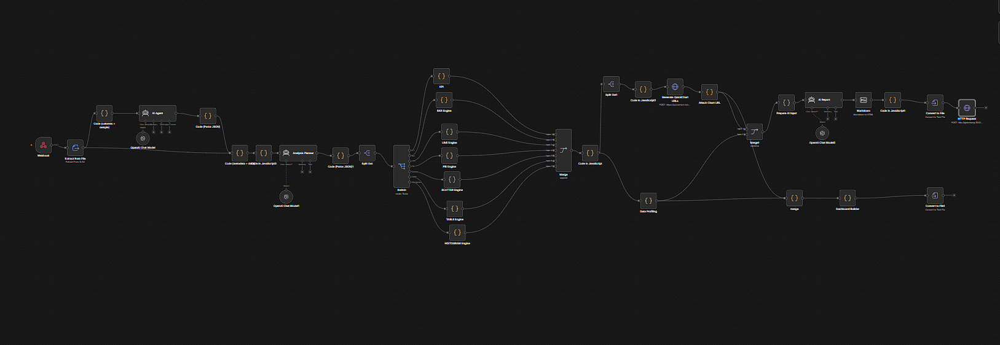
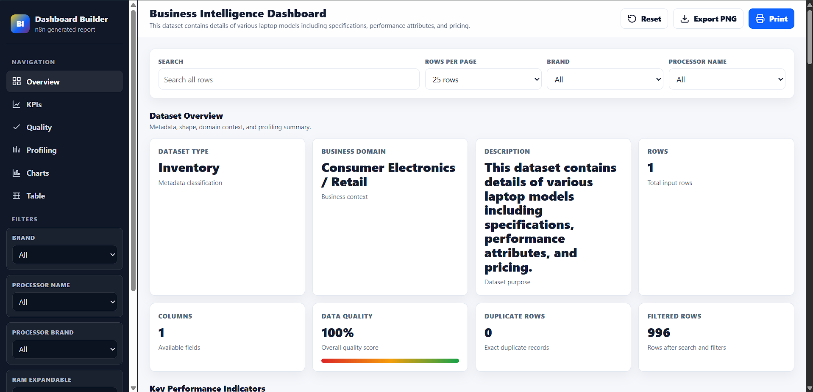
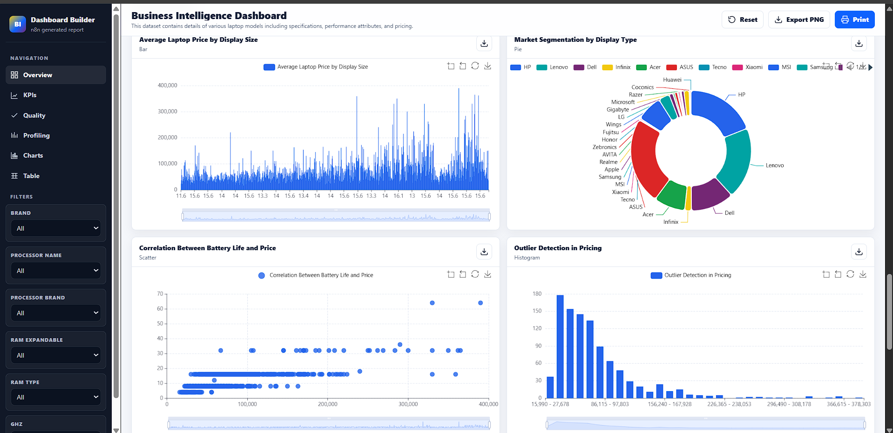
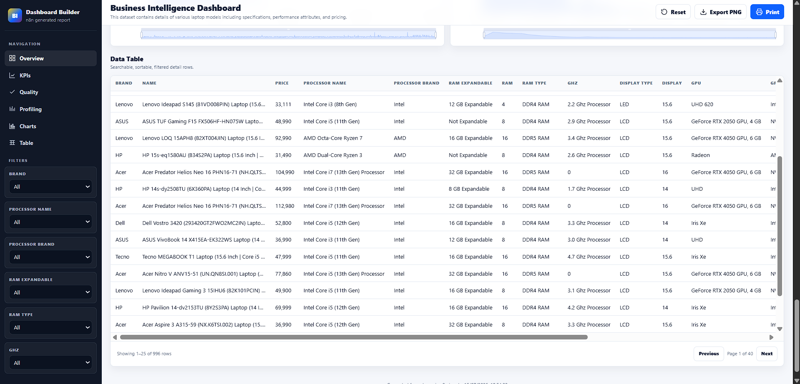

# 🤖 AI Analysis Agent

> An AI-powered Business Intelligence Automation Workflow built with **n8n** that transforms raw datasets into interactive dashboards, KPI reports, and business insights using Large Language Models (LLMs).

---

## 📌 Overview

AI Analysis Agent is an end-to-end data analysis workflow developed using **n8n**.

The workflow automatically accepts structured datasets, analyzes them with AI, generates meaningful business insights, creates interactive visualizations, and exports professional reports without requiring manual analysis.

It is designed to automate repetitive Business Intelligence tasks and significantly reduce the time required to analyze datasets.

---

## ✨ Features

- 📂 Upload CSV, Excel, or JSON datasets
- 🤖 AI-powered dataset understanding
- 📊 Automatic KPI generation
- 📈 Interactive Business Intelligence Dashboard
- 📉 Data Profiling
- ✅ Data Quality Analysis
- 🧠 Automatic Business Insights
- 📋 Dataset Metadata Extraction
- 📄 HTML Dashboard Generation
- 📑 PDF Report Generation
- 🖨️ Print-ready Reports
- 📷 Dashboard Export
- ⚡ Fully Automated Workflow
- 🔄 No-Code Automation using n8n

---

# 🏗 Workflow Architecture

<p align="center">

</p>

The workflow orchestrates multiple AI and automation components to generate a complete Business Intelligence report automatically.

---

# 📊 Generated Dashboard

<p align="center">

</p>

The generated dashboard includes:

- Executive Overview
- KPI Cards
- Dataset Statistics
- Data Quality Metrics
- Column Profiling
- Interactive Charts
- Searchable Data Table
- Export to PNG
- Print Dashboard

---

# 📈 Dashboard Preview

| Overview | Charts |
|----------|--------|
|  |  |

| Profiling | Data Table |
|-----------|------------|
|  |  |

---

# ⚙️ Technologies Used

- n8n
- OpenAI API
- JavaScript
- HTML5
- Apache ECharts
- JSON
- AI Agents
- Prompt Engineering

---

# 📂 Project Structure

```
AI-analysis-Agent
│
├── workflows
│   └── AI-analysis-Agent.json
│
├── output
│   ├── Business_Intelligence_Dashboard.html
│   └── Business_Report.pdf
│
├── images
│   ├── workflow.png
│   ├── dashboard-overview.png
│   ├── dashboard-charts.png
│   ├── dashboard-profiling.png
│   └── dashboard-table.png
│
└── README.md
```

---

# 🚀 Generated Outputs

The workflow automatically generates:

- 📄 Interactive HTML Dashboard
- 📑 Professional PDF Report
- 📊 KPI Summary
- 📈 Interactive Charts
- 📋 Data Profiling Report
- 📉 Data Quality Analysis
- 📌 Dataset Metadata
- 💡 AI Business Insights

---

# 💼 Use Cases

- Business Intelligence
- Data Analysis Automation
- Executive Reporting
- Retail Analytics
- Financial Reporting
- Sales Analysis
- Data Profiling
- AI-powered Reporting

---

# ▶️ How to Use

1. Import the workflow into n8n.
2. Configure your AI credentials.
3. Upload a dataset (CSV, Excel, or JSON).
4. Execute the workflow.
5. The workflow automatically generates:
   - Interactive Dashboard
   - PDF Report
   - KPI Summary
   - Business Insights

---

# 📄 Example Output

The generated dashboard provides:

- Interactive visualizations
- Professional KPI cards
- Executive summaries
- Dataset profiling
- Data quality metrics
- Searchable data table
- Exportable reports

---

# 📜 License

MIT License
